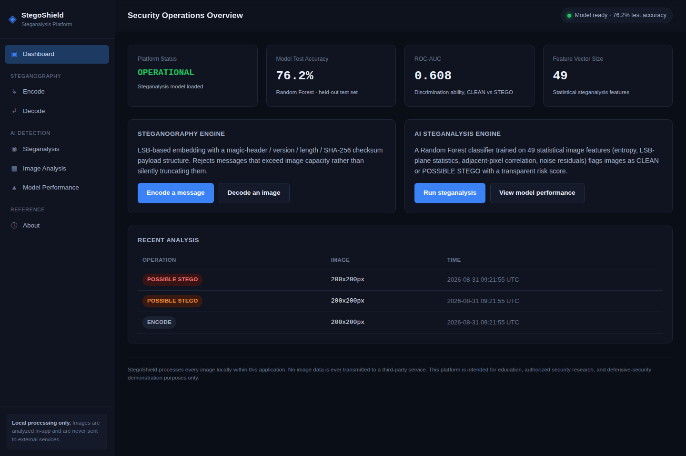
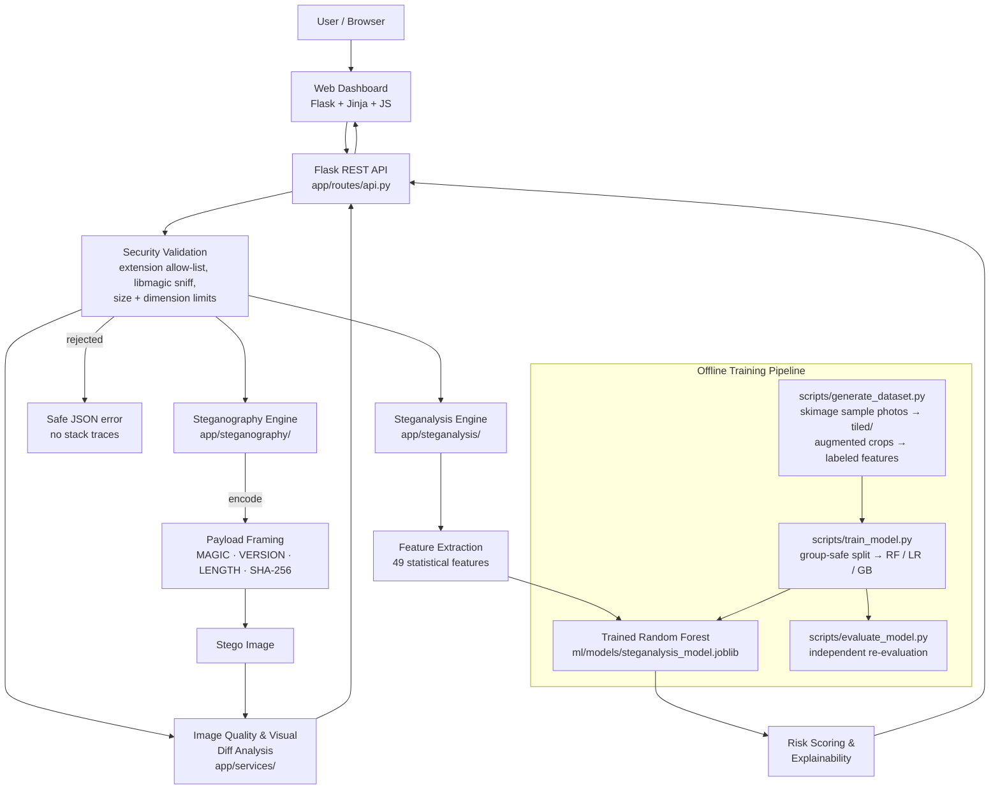
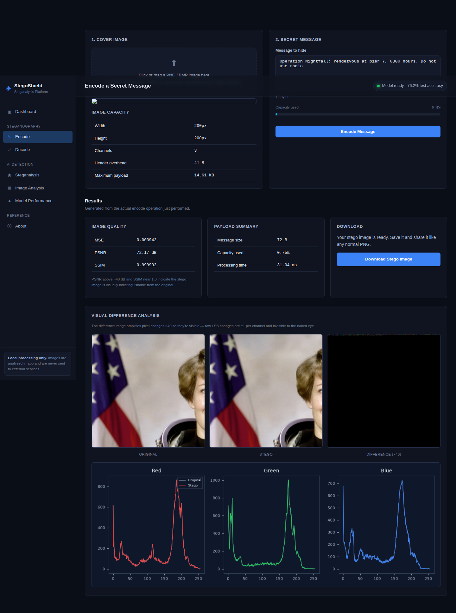
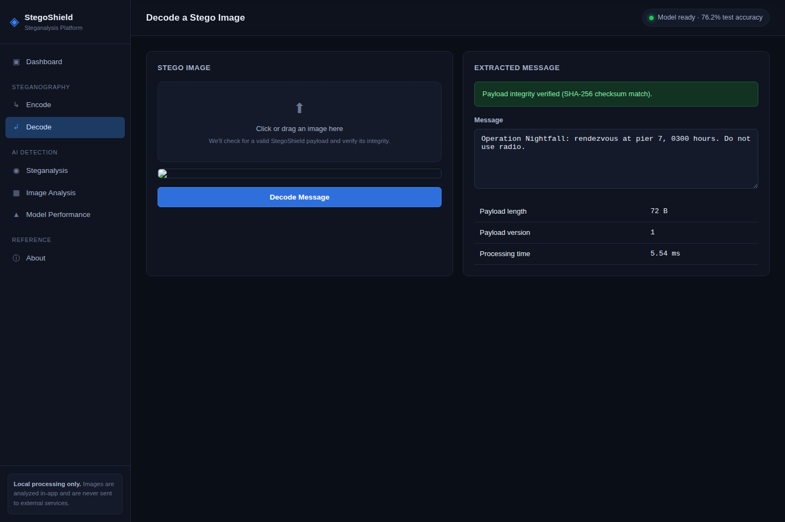
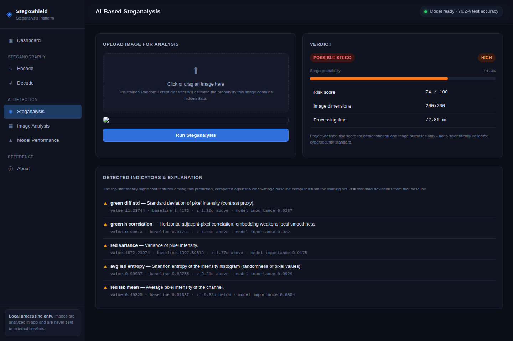
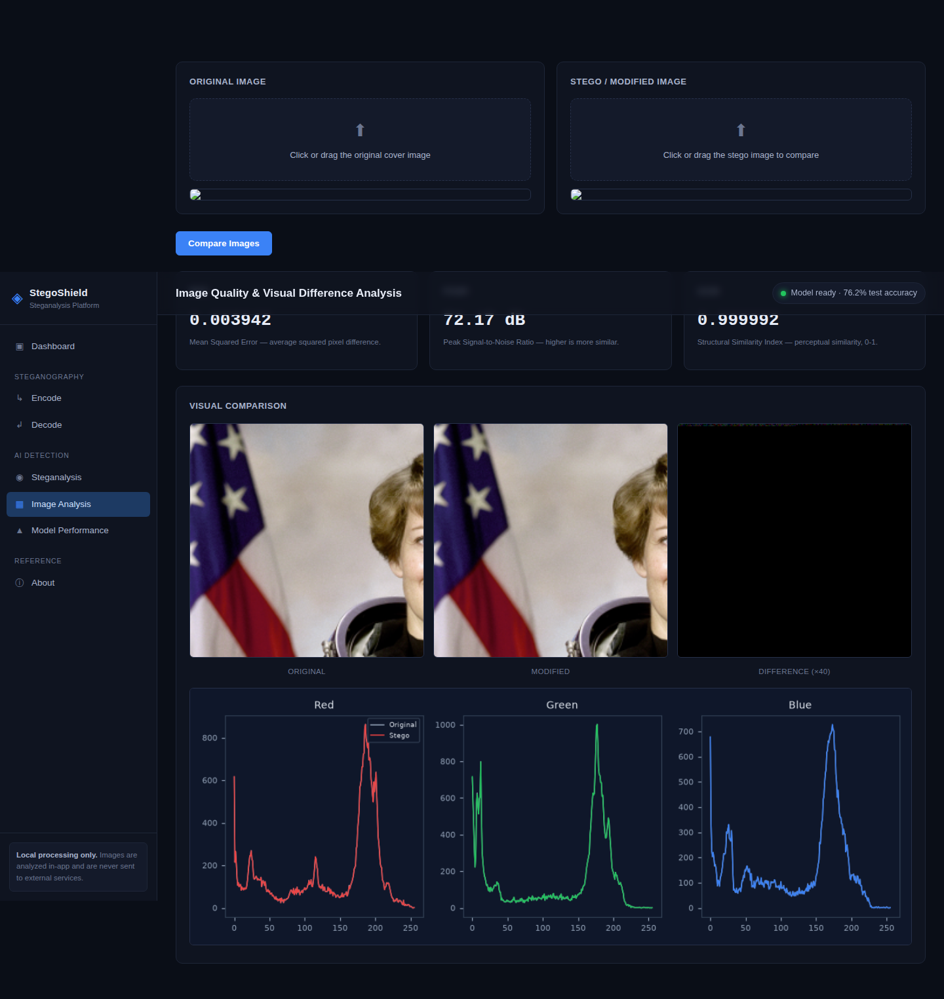
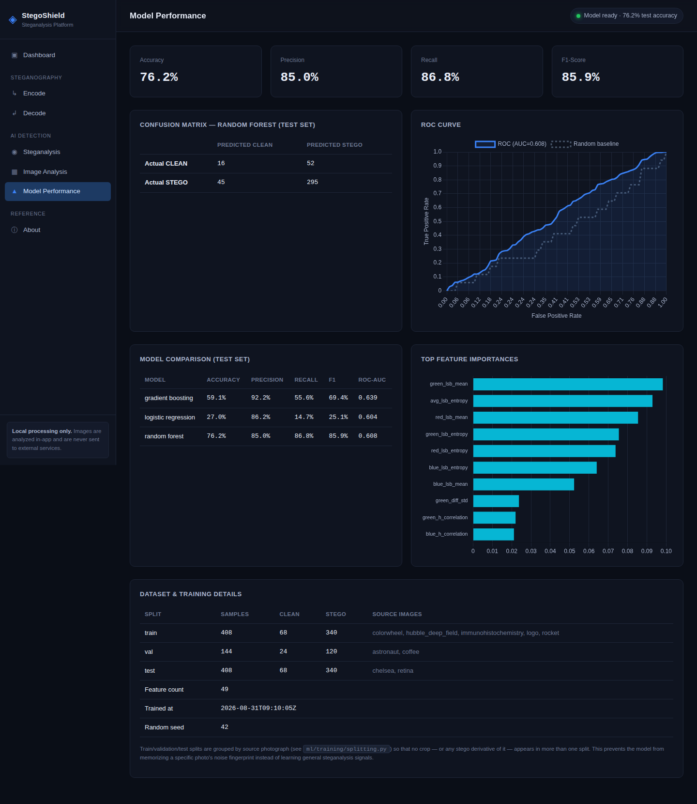

# StegoShield

> AI-Assisted Image Steganography & Steganalysis Platform

[](https://www.python.org/)
[](https://flask.palletsprojects.com/)
[](https://scikit-learn.org/)
[](tests/)
[](LICENSE)

StegoShield hides secret messages inside images using LSB
steganography, then uses a trained machine-learning classifier to
detect whether an image likely contains a hidden payload — pairing the
offensive technique with its defensive counterpart, steganalysis,
inside one working application.

## Live Demo

https://YOUR-DEPLOYED-URL

*(Placeholder until the deployment below is live-tested and confirmed
returning HTTP 200 - see "Production Deployment (Vercel)" for status.)*

## Local Development

```bash
python run.py
```



---

## Table of Contents

1. [Project Overview](#1-project-overview)
2. [Why This Matters](#2-why-this-matters)
3. [Features](#3-features)
4. [Architecture](#4-architecture)
5. [Technology Stack](#5-technology-stack)
6. [How It Works](#6-how-it-works)
7. [Steganography Algorithm](#7-steganography-algorithm)
8. [ML Pipeline](#8-ml-pipeline)
9. [Results](#9-results)
10. [Getting Started](#10-getting-started)
11. [Reproducing the Experiments](#11-reproducing-the-experiments)
12. [Project Structure](#12-project-structure)
13. [Testing](#13-testing)
14. [Screenshots](#14-screenshots)
15. [Limitations](#15-limitations)
16. [Future Improvements](#16-future-improvements)
17. [Ethical Use](#17-ethical-use)
18. [Documentation Index](#18-documentation-index)

---

## 1. Project Overview

StegoShield is a two-sided cybersecurity platform:

- **Steganography engine** — embed a secret text message into a PNG/BMP
  cover image using Least Significant Bit (LSB) encoding, with a
  proper payload format (magic header, version, length, SHA-256
  checksum) so corrupted or non-StegoShield images are handled
  gracefully rather than producing garbage output.
- **AI steganalysis engine** — extract 49 statistical image features
  and use a trained Random Forest classifier to estimate whether a
  given image is `CLEAN` or `POSSIBLE STEGO`, with a transparent,
  probability-derived risk score and a per-prediction explanation of
  the top contributing features.

It's built as a portfolio-quality demonstration of the full pipeline —
**Steganography → Steganalysis → Threat Detection** — with real,
reproducible data and honestly reported (imperfect) results, not
hardcoded metrics.

## 2. Why This Matters

Image steganography is not purely academic. It has legitimate uses
(digital watermarking, covert communication under censorship) but is
also a documented technique in real threats:

- **Covert communication / command-and-control** — malware has used
  steganography to smuggle instructions or payloads inside images that
  pass casual visual inspection and many content filters.
- **Data exfiltration** — sensitive data can be hidden inside image
  uploads to evade data-loss-prevention tooling that only inspects
  file type, not statistical content.
- **Digital forensics** — investigators need tooling to determine
  whether seized or intercepted media contains hidden data.
- **Steganalysis as SOC triage** — Security Operations Center and
  forensics teams increasingly need automated first-pass steganalysis,
  the same way they use YARA rules or behavioural detection for other
  threat classes.

## 3. Features

**Steganography (Modules 1–3)**
- LSB embedding across R/G/B channels with capacity validation (never
  silently truncates a message that doesn't fit)
- Magic header + version + length + SHA-256 checksum payload framing
- Graceful, specific error messages for "no payload found" vs.
  "payload found but corrupted"

**Image analysis (Modules 4–5)**
- Real MSE / PSNR / SSIM computed from actual pixel arrays
- Exaggerated (×40) visual difference image + per-channel histogram
  comparison, generated from the real images every time

**AI steganalysis (Module 6)**
- 49 hand-engineered statistical features per image (entropy, LSB-plane
  statistics, adjacent-pixel correlation, noise residuals, histogram
  characteristics, cross-channel correlation)
- Random Forest primary model, compared against Logistic Regression and
  Gradient Boosting on an identical, leak-safe train/val/test split
- Feature-importance-driven, per-prediction explanations (not
  templated boilerplate)
- Transparent, model-probability-derived risk scoring (LOW / MEDIUM /
  HIGH / CRITICAL), explicitly labeled as a project-defined triage
  score rather than an industry standard

**Security engineering**
- Extension allow-list + real content-type sniffing (libmagic) +
  Pillow re-decode validation — a renamed `.exe` is rejected even with
  a `.png` extension
- File size and image dimension ceilings (decompression-bomb guard)
- No uploaded bytes ever touch disk — the entire pipeline runs on
  in-memory buffers, eliminating temp-file cleanup risk entirely
- Global error handling that never leaks a stack trace or filesystem
  path to the client
- Rate limiting, structured logging (never logs secret content or raw
  image bytes), and security response headers (CSP, X-Frame-Options,
  etc.)

**Web dashboard**
- Dark, professional "SOC dashboard" UI across 7 pages: Dashboard,
  Encode, Decode, Steganalysis, Image Analysis, Model Performance,
  About
- Real Chart.js visualizations (ROC curve, feature importances) fed
  entirely by the trained model's actual metrics — Chart.js is
  vendored locally, so the app runs fully offline with no CDN
  dependency

## 4. Architecture



## 5. Technology Stack

| Layer | Technology |
|---|---|
| Backend framework | Flask 3.1, Flask-Limiter |
| Steganography | Pillow, NumPy |
| Machine learning | scikit-learn (Random Forest / Logistic Regression / Gradient Boosting), scikit-image (SSIM), SciPy, pandas |
| Image quality metrics | NumPy (MSE/PSNR), scikit-image (SSIM) |
| Visualization | Chart.js (vendored, offline), Matplotlib (server-side histogram rendering) |
| File-type validation | python-magic (libmagic content sniffing) |
| Frontend | HTML5, CSS3 (hand-written, no framework), vanilla JavaScript |
| Testing | pytest (60 tests) |
| Serialization | joblib (model artifact) |

## 6. How It Works

1. A user uploads a cover image and enters a secret message on the
   **Encode** page. The backend validates the file (real content
   sniffing, not just the extension), computes the image's exact byte
   capacity, and rejects the message outright if it won't fit — no
   silent truncation.
2. The message is wrapped in a framed payload (`MAGIC + VERSION +
   LENGTH + SHA-256(message) + message`) and embedded bit-by-bit into
   the least significant bit of each R/G/B channel value.
3. The **Decode** page reverses this: it reads the header, verifies
   the magic bytes are present at all (distinguishing "not a
   StegoShield image" from "corrupted StegoShield image"), then
   verifies the SHA-256 checksum before trusting the extracted text.
4. The **Steganalysis** page runs any uploaded image through 49
   statistical feature extractors and a trained Random Forest to
   produce a `CLEAN` / `POSSIBLE STEGO` verdict, a risk score, and the
   specific features that drove the prediction.
5. The **Model Performance** page reports the actual metrics from the
   last training run (`ml/models/model_metadata.json`) — nothing here
   is hand-typed.

## 7. Steganography Algorithm

For an 8-bit channel value `p` and secret bit `b ∈ {0, 1}`:

```
embed:    p' = (p & 0xFE) | b        # clear the LSB, then set it to b
extract:  b  = p' & 1                # read the LSB back out
```

Because `p'` differs from `p` by at most 1 (in [0, 255]), the change is
imperceptible. Bits are embedded sequentially across the flattened
R, G, B bytes of the image in row-major order (the alpha channel, if
present, is left untouched).

**Capacity.** For an image of width `W`, height `H`, and `C` usable
channels (3 for RGB):

```
total_capacity_bits  = W × H × C
total_capacity_bytes = ⌊total_capacity_bits / 8⌋
max_message_bytes    = total_capacity_bytes − header_overhead_bytes   (41 bytes)
```

**Payload framing** (`app/steganography/payload.py`):

```
+----------+-----------+----------------+-------------------+--------------------+
| MAGIC    | VERSION   | PAYLOAD_LENGTH | SHA-256 CHECKSUM   | PAYLOAD (message)  |
| 4 bytes  | 1 byte    | 4 bytes (u32)  | 32 bytes           | N bytes            |
| b"STG1"  | 0x01      |                | of PAYLOAD only    |                    |
+----------+-----------+----------------+-------------------+--------------------+
```

Decoding first checks the magic bytes (cheaply distinguishes "never
encoded by StegoShield" from a real payload), then re-hashes the
extracted bytes and compares against the stored checksum before
trusting them — corrupted or tampered images fail loudly with
`ERROR: Payload detected but integrity verification failed`, rather
than returning garbled text.

## 8. ML Pipeline

```
Dataset generation (scripts/generate_dataset.py)
    ↓  9 public-domain photos (skimage.data) → tiled 256×256 crops
    ↓  (capped per photo) → flip/rotate augmentation → LSB-encode at
    ↓  5 payload levels (5/10/20/30/50% capacity utilization)
Feature extraction (app/steganalysis/features.py)
    ↓  49 features/image: channel stats, entropy, LSB-plane stats,
    ↓  adjacent-pixel correlation, noise residuals, histogram stats,
    ↓  cross-channel correlation
Leak-safe train/val/test split (ml/training/splitting.py)
    ↓  GroupShuffleSplit BY SOURCE PHOTOGRAPH — no crop, augmentation,
    ↓  or stego derivative of one photo crosses a split boundary
Model training (scripts/train_model.py)
    ↓  Random Forest (primary) + Logistic Regression + Gradient
    ↓  Boosting, all on the identical split, StandardScaler-normalized
Evaluation (ml/evaluation/metrics.py, scripts/evaluate_model.py)
    ↓  Accuracy / Precision / Recall / F1 / ROC-AUC / confusion matrix
    ↓  — independently reproducible by reloading the saved model
Inference (app/steganalysis/predictor.py)
    ↓  Same feature extractor, cached model, <100ms typical latency
Risk scoring (app/steganalysis/risk_scoring.py)
    → LOW / MEDIUM / HIGH / CRITICAL, derived from model probability
```

**Why a Random Forest?** It's a strong, interpretable baseline for
tabular statistical features that doesn't need huge amounts of data to
avoid overfitting (unlike deep learning on raw pixels), it exposes
native feature importances for the explainability requirement, and
`class_weight="balanced"` handles this dataset's class imbalance
reasonably. It's benchmarked here against Logistic Regression (linear
baseline) and Gradient Boosting (a second ensemble) on the exact same
split — see the Model Performance page or `docs/research-notes.md`.

## 9. Results

**These are the actual numbers from the last training run in this
repository** (`ml/models/model_metadata.json`, reproducible via
`scripts/evaluate_model.py` — see [§11](#11-reproducing-the-experiments)).
Dataset: 960 samples from 9 source photographs, split by source image
(train: 5 photos/408 samples, val: 2 photos/144 samples, test: 2
photos/408 samples).

**The honest framing of this project isn't "an AI that detects
steganography at 76% accuracy."** It's this: a working detector was
built, evaluated rigorously (not on one lucky split), found to have a
real generalization weakness, diagnosed *why* that weakness existed,
and improved with evidence rather than by tuning a headline number.
The sections below walk through that process, including the parts
that didn't work.

| Model | Accuracy | Balanced Acc. | Precision | Recall | Specificity | FPR | F1 | ROC-AUC | PR-AUC |
|---|---|---|---|---|---|---|---|---|---|
| **Random Forest (primary)** | 61.0% | 64.9% | 91.0% | 59.1% | 70.6% | 29.4% | 71.7% | **0.725** | **0.922** |
| Gradient Boosting | 59.1% | **66.0%** | 92.2% | 55.6% | **76.5%** | 23.5% | 69.4% | 0.639 | 0.902 |
| Logistic Regression | 27.0% | 51.5% | 86.2% | 14.7% | 88.2% | 11.8% | 25.1% | 0.604 | 0.878 |

Confusion matrix (Random Forest, test set, n=408):

| | Predicted CLEAN | Predicted STEGO |
|---|---|---|
| **Actual CLEAN** | 48 | 20 |
| **Actual STEGO** | 139 | 201 |

### Why Random Forest, when Gradient Boosting has better balanced accuracy?

This got a real review, not an assumption. Single-split ROC-AUC
(2 held-out photos) is too fragile a basis for this decision, so the
comparison was redone with **9-fold leave-one-source-photo-out
cross-validation** — every one of the 9 available photos held out in
turn, all 960 samples scored as out-of-fold predictions exactly once
(`scripts/cross_validate_models.py`, full output in
`data/dataset/cross_validation_results.json`):

| Config | ROC-AUC | PR-AUC | Balanced Acc. | TPR @ FPR≤20% |
|---|---|---|---|---|
| **Random Forest, `class_weight=None`** | **0.697** | **0.921** | 0.587 | **0.544** |
| Gradient Boosting | 0.685 | 0.919 | **0.616** | 0.425 |
| Random Forest, `class_weight='balanced'` (old default) | 0.660 | 0.917 | 0.526 | 0.483 |
| Logistic Regression, `class_weight='balanced'` | 0.529 | 0.843 | 0.505 | 0.251 |

**The criterion used:** TPR at a fixed, operationally realistic
false-positive-rate budget (≤20%), not raw ROC-AUC and not a
symmetric-cost accuracy metric. This app is framed throughout as a
human-in-the-loop *triage* aid — an analyst reviews what gets flagged
— so the relevant question is "how much real signal survives at a
false-alarm rate an analyst could actually tolerate," which is
standard practice for evaluating detection systems. Under that
criterion Random Forest wins. **Gradient Boosting has the better
balanced accuracy** of the two — the more defensible pick if you treat
a missed detection and one extra image to review as equally costly.
That tradeoff is stated here rather than hidden; it's a judgment call
about relative costs, not an objective fact. Full reasoning:
`docs/research-notes.md` (Experiment D).

### The false-positive problem, and what actually fixed part of it

The originally-shipped Random Forest used `class_weight='balanced'` to
correct for a real 5:1 STEGO:CLEAN imbalance in the training data
(each clean crop is embedded at 5 payload levels). It seemed like the
right call. Cross-validated across all 9 photos, it measurably made
things *worse*: a pooled 90% false-positive rate on clean images,
against 62.5% with `class_weight=None`. The best-supported explanation
(stated as a hypothesis, not proven mechanism — see
`docs/research-notes.md`): with only ~18 independent clean crops per
training photo, upweighting them ~5x pushed the trees toward splits
that overfit those specific photos' texture/noise fingerprints rather
than a transferable "clean" signature — a cover-source-mismatch effect
documented in the steganalysis literature.

Dropping `class_weight='balanced'` (now the default) triples CLEAN
accuracy on the standard test split (23.5% → 70.6%) and raises
ROC-AUC from 0.608 to 0.725. **It is not a free fix** — it trades away
real detection sensitivity, especially at low payload levels (5%
capacity utilization: 79.4% → 35.3% detected; 50%: 97.1% → 76.5% —
see Experiment B in `docs/research-notes.md`). The model moved to a
more conservative point on a genuinely better ROC curve, not to a
strictly-better model. **Its remaining CLEAN accuracy (70.6%, i.e. a
~29% false-positive rate) is still a real, unresolved weakness**, not
fixed, only substantially reduced — reported plainly rather than
buried, with the full breakdown in [§15](#15-limitations) and
`docs/research-notes.md`.

Image-quality cost of embedding (Experiment A, averaged across all
base images):

| Payload level | Mean MSE | Mean PSNR | Mean SSIM |
|---|---|---|---|
| 5%  | 0.025 | 64.1 dB | 0.9997 |
| 50% | 0.250 | 54.2 dB | 0.9957 |

Even at 50% capacity utilization, PSNR stays well above the ~40 dB
threshold conventionally considered visually indistinguishable.

## 10. Getting Started

```bash
git clone <this-repository-url>
cd stegoshield

python3 -m venv venv
source venv/bin/activate        # Windows: venv\Scripts\activate

pip install -r requirements.txt

cp .env.example .env            # then edit SECRET_KEY for any real deployment

# Train the steganalysis model (see §11 for details) - required once
# before the Steganalysis / Model Performance pages have data:
python scripts/generate_dataset.py
python scripts/train_model.py

python run.py
# → http://127.0.0.1:5000
```

For a production-style run:

```bash
pip install gunicorn
FLASK_ENV=production gunicorn "app:create_app()" --bind 0.0.0.0:5000 --workers 2
```

## Production Deployment (Vercel)

The app is deployed as a Vercel Function running the existing Flask
app object (`wsgi.py`) behind Vercel's Python WSGI runtime - no
gunicorn/Docker layer is used because Vercel's own runtime replaces
that role for this platform.

**Why Vercel, given the ML dependency stack.** The audit before this
deployment measured the runtime install (`numpy` + `scipy` +
`scikit-learn` + `scikit-image` + `Pillow` + `matplotlib` + `joblib`)
at ~460MB, over the generic 250MB Vercel Function limit but under
Python's own 500MB allowance, and comfortably under the 5GB "Fluid
Compute large functions" ceiling that new Vercel projects get
automatically. Three platform-specific changes were required to make
the existing app run unmodified in behavior:

1. **Model file at build time.** `ml/models/steganalysis_model.joblib`
   is intentionally gitignored (kept out of the repo as a binary
   artifact). `build_vercel.py` runs
   `scripts/generate_dataset.py` + `scripts/train_model.py`
   (`pyproject.toml`'s `[tool.vercel.scripts] build`) before Vercel
   packages the function, so the trained model exists on disk before
   the app starts. Both scripts are seeded (42) and use scikit-image's
   *bundled* sample images, so this is deterministic and needs no
   network access during the build.
2. **`python-magic` needs system `libmagic`,** which Vercel's Python
   runtime doesn't ship. Added `pylibmagic` (bundles the shared
   library + signature database) and one import line in
   `app/security/validators.py` - the content-sniffing security check
   itself is unchanged.
3. **Filesystem + request-size limits**, both handled purely through
   environment variables, no code changes:
   - `UPLOAD_TEMP_DIR=/tmp/stegoshield` - the deployed source tree is
     read-only except `/tmp`.
   - `LOG_FILE=/tmp/stegoshield-logs/app.log` - same reason; the app
     already falls back to console-only logging if this path isn't
     writable, and Vercel captures stdout as function logs regardless.
   - `MAX_CONTENT_LENGTH_MB=2` - Vercel's platform-level request body
     limit (~4.5MB, not configurable) sits below the app's local
     default of 10MB, and the image-analysis endpoint uploads two
     files in one request.

**Required environment variables** (Project → Settings → Environment
Variables): `FLASK_ENV=production`, `DEBUG=False`, `SECRET_KEY`
(random, generated per deployment - never committed),
`UPLOAD_TEMP_DIR=/tmp/stegoshield`, `LOG_FILE=/tmp/stegoshield-logs/app.log`,
`MAX_CONTENT_LENGTH_MB=2`. See `.env.example` for the full list and
local-development defaults.

**Known limitations of this deployment** (stated plainly, not hidden):
- **Per-instance rate limiting.** Flask-Limiter's default in-memory
  store isn't shared across serverless instances, so the configured
  limits apply per warm container, not globally. A distributed store
  (e.g. Redis) would be needed for a true global limit; out of scope
  for a portfolio demo.
- **Cold starts.** Importing `scipy`/`scikit-learn`/`scikit-image`/
  `matplotlib` and loading the model takes several seconds on a cold
  container. Subsequent requests to a warm instance are fast because
  `ModelRegistry` (see `app/steganalysis/predictor.py`) caches the
  loaded model in-process.
- **2MB upload ceiling** on the public deployment (vs. 10MB locally),
  imposed by Vercel's platform request-size limit, not by the app.
- **No persistent storage** - uploads are processed in memory/`/tmp`
  and never retained, by design (see `app/security/file_handler.py`);
  this also means there's nothing to back up or migrate, but it's a
  deliberate privacy/security property either way.

## 11. Reproducing the Experiments

Every number in [§9](#9-results) and `docs/research-notes.md` comes
from these exact commands, with a fixed random seed:

```bash
# 1. Build the labeled dataset (writes data/dataset/features.csv + manifest.json)
python scripts/generate_dataset.py --seed 42

# 2. Train Random Forest / Logistic Regression / Gradient Boosting on a
#    leak-safe split, save the primary model + full metrics
python scripts/train_model.py --seed 42

# 3. Independently reload the saved model and re-verify the test metrics
python scripts/evaluate_model.py

# 4. Run the payload-size-vs-quality and payload-size-vs-detection experiments
python scripts/run_experiments.py

# 5. (Optional, ~20s) 9-fold leave-one-source-photo-out cross-validation
#    across all 4 model/class-weight configurations tested - this is what
#    the primary-model decision in §9 is actually based on, not a single
#    split. Writes data/dataset/cross_validation_results.json.
python scripts/cross_validate_models.py

# 6. (Optional, ~5s) The single-split diagnostic that first surfaced the
#    class-imbalance finding, kept for transparency alongside step 5's
#    more robust cross-validated version. Writes
#    data/dataset/class_balance_experiment_results.json.
python scripts/experiment_class_balance.py
```

## 12. Project Structure

```
stegoshield/
├── app/
│   ├── config.py                 # Env-driven configuration
│   ├── routes/                   # pages.py (HTML), api.py (JSON API)
│   ├── services/                 # Orchestration: encode/decode/analysis/model
│   ├── steganography/            # LSB core, payload framing, capacity, encoder/decoder
│   ├── steganalysis/             # Feature extraction, predictor, risk scoring, explainability
│   ├── security/                 # Upload validation, secure temp-file infra
│   └── utils/                    # Image I/O, logging, error mapping
├── ml/
│   ├── dataset/                  # Base image corpus + tiling/augmentation/generation
│   ├── features/                 # Thin re-export of app/steganalysis/features.py
│   ├── training/                 # Leak-safe splitting, train_model core
│   ├── evaluation/               # Metrics computation
│   └── models/                   # Trained model artifact + metadata (generated)
├── frontend/
│   ├── templates/                # Jinja2 pages (dashboard, encode, decode, ...)
│   └── static/{css,js}/          # Hand-written CSS, vanilla JS, vendored Chart.js
├── tests/                        # 60 pytest tests across 5 files
├── scripts/                      # generate_dataset.py, train_model.py, evaluate_model.py,
│                                  # run_experiments.py, cross_validate_models.py,
│                                  # experiment_class_balance.py
├── data/                         # sample_images/ (committed, small); dataset/ + tmp/ (generated, git-ignored)
├── docs/                         # research-notes, interview-questions, linkedin-post, security-review, screenshots
├── requirements.txt / .env.example / .gitignore / LICENSE / run.py
```

## 13. Testing

```bash
pip install -r requirements.txt
pytest
```

70 tests across `tests/test_steganography.py` (encode/decode round-trips,
empty/large/unicode messages, capacity limits, corrupted-payload
integrity detection), `tests/test_security.py` (extension/content-type
validation, oversized files, path-traversal-safe filenames, CSP
correctness, error responses never leak internals), `tests/test_file_handling.py`
(secure temp-file lifecycle, request size limits), `tests/test_ml.py`
(feature extraction, dataset tiling, leak-safe group splitting,
evaluation metrics — including balanced accuracy, specificity,
false-positive rate, PR-AUC, and TPR-at-fixed-FPR, each checked against
scikit-learn's own reference implementation — training/evaluation
mechanics, inference), and `tests/test_api.py` (full Flask-test-client
coverage of every endpoint and page).

## 14. Screenshots

| | |
|---|---|
|  Dashboard |  Encode results — quality metrics, diff heatmap, histograms |
|  Decode & integrity verification |  AI steganalysis verdict & explanation |
|  Standalone image comparison |  Model performance dashboard |

All screenshots in `docs/screenshots/` were captured directly from a
running instance of this application (via Playwright) using real data
produced by the app itself — not mockups.

## 15. Limitations

Read in full in `docs/research-notes.md` and `docs/security-review.md`.
In short:

- **Small training corpus.** 9 public-domain photographs (via
  `skimage.data`), tiled and augmented into 960 samples — far smaller
  than research-grade corpora like BOSSbase (10,000 images) or
  ALASKA2 (75,000+). Reported accuracy should be read as a
  methodology demonstration, not a general-purpose detection claim.
- **Low-payload detection is hard**, as expected from the literature,
  and got harder after the class-weighting fix below traded sensitivity
  for specificity: accuracy at 5% capacity utilization is now 35.3%
  (was 79.4%), 50% is 76.5% (was 97.1%). See [§9](#9-results).
- **Observed false-positive bias on clean images, reduced but not
  solved.** Substantially cut by removing `class_weight='balanced'`
  (CLEAN accuracy 23.5% → 70.6% on the standard test split, a pooled
  90% → 62.5% false-positive rate across 9-fold cross-validation) —
  but a ~29–37% false-positive rate on clean images is still a real,
  open weakness, not a fixed one. See [§9](#9-results) and Experiment D
  in `docs/research-notes.md`.
- **The class-weighting fix rests on 9 photos, not thousands.**
  Leave-one-photo-out cross-validation is far more robust than a
  single 2-photo split, but still draws from the same small corpus —
  the next real validation step is a larger, independent corpus.
- **Pipeline-specific model.** Trained only against StegoShield's own
  sequential LSB embedder; not validated against other steganography
  tools, adaptive/content-aware embedding, or JPEG-domain
  steganography.
- **Academic prototype, not a production IDS.** No claim of
  production-grade security or detection reliability is made — see
  `docs/security-review.md` for the full, itemized security
  self-assessment (nothing here is asserted "100% secure").

## 16. Future Improvements

- **Decision-threshold tuning.** The model still predicts at the
  default 0.5 probability threshold; the improved ROC-AUC (0.725) and
  the new `tpr_at_fpr` metric (`ml/evaluation/metrics.py`) make it
  possible to choose an explicit, justified operating point instead
  (e.g. the threshold that hits a target false-positive rate) — not
  done here, since it's a further behavior change beyond this pass's
  scope, but the machinery to do it responsibly now exists.
- CNN-based steganalysis (e.g. SRNet/XuNet-style) as an optional
  advanced module, benchmarked against the classical-feature Random
  Forest on the same split
- JPEG/DCT-domain steganalysis
- Adaptive/content-aware embedding (HUGO/WOW/S-UNIWARD) as a harder
  detection target
- Adversarial-ML evaluation: can a stego image be perturbed to evade
  this specific classifier while preserving the payload?
- Real-time SOC/SIEM integration as a triage signal (not a standalone
  blocking decision, given the documented false-positive rate)
- Larger, research-scale training corpus (BOSSbase/ALASKA2)

## 17. Ethical Use

StegoShield is built for **education, cybersecurity research, and
defensive-security demonstration**. All image processing happens
locally within the application — no uploaded image is ever sent to an
external service. This project is not intended, marketed, or optimized
to facilitate covert criminal communication; the steganalysis half
exists specifically to help detect misuse of the steganography half.

## 18. Documentation Index

- [`docs/research-notes.md`](docs/research-notes.md) — research
  questions, real experimental results, dataset limitations, future work
- [`docs/security-review.md`](docs/security-review.md) — itemized
  security self-assessment (findings, severity, status, mitigation)
- [`docs/interview-questions.md`](docs/interview-questions.md) — 27
  technical Q&A grounded in this specific implementation
- [`docs/linkedin-post.md`](docs/linkedin-post.md) — a project
  announcement write-up, honest numbers included

---

*Built as a demonstration of applied cybersecurity + AI/ML engineering:
steganography, digital forensics fundamentals, statistical feature
engineering, leak-safe ML evaluation methodology, and secure web
application development.*
